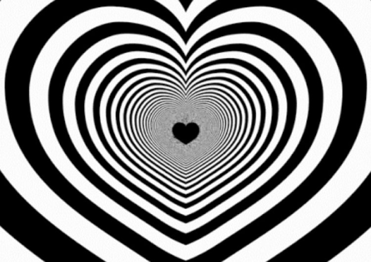

I am a postgraduate student in the University of Glasgow's
[Institute of Neuroscience and Psychology](http://www.gla.ac.uk/researchinstitutes/neurosciencepsychology/).
I work with [Martin Lages](https://www.gla.ac.uk/schools/psychology/staff/martinlages/).

Contact me: 2421693d@student.gla.ac.uk
Find more about me at [About Junjie Dong](https://cedricdong.github.io/mywebpage/)

#Academic Background:

* Bachelor of Arts (Social Science)   2014 - 2017
    * Major in Psychology
    * Monash University
* Master of Science in Research Methods of Psychological Science
    * University of Glasgow
    * Dissertation Tittle: "Perceived Offset Between Subjects"

#Skills:

1. Software: SPSS, R
1. Languages: English (Fluent), Mandarin (Native), Kunminguese (Native)

#Research Interests:
I'm currently working on studying the visual illusions and the schemas behind them, trying to explain and apply these illusions. I help people understand what goes on inside the illusions.

